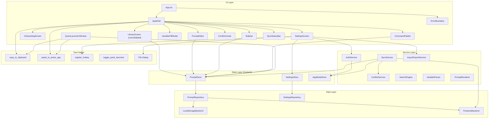

# Design Document: Full App Wiring

## Overview

This feature connects all existing layers of PromptDock — UI components, Zustand stores, repository layer, services, and Tauri native commands — into a fully functional application. The architecture is ~70% complete with all individual pieces built, but the critical wiring between layers is missing. AppShell uses mock data and a local `useReducer` instead of real Zustand stores. Settings, authentication, sync, Tauri native commands, and import/export are not connected to the UI.

The design follows a **progressive wiring** approach: start with the core data flow (PromptStore → AppShell), then layer on settings, clipboard, auth, sync, and error handling. Each wiring task is independent enough to be implemented and tested in isolation.

### Key Design Decisions

1. **Remove AppShell's useReducer entirely** — Replace with direct Zustand store selectors. The `appReducer`, `AppState`, and `AppAction` types become unnecessary. Navigation state (current screen, selected prompt, search query, filters) moves into a lightweight local state or a new UI store, while data operations delegate to PromptStore.

2. **Consolidate duplicate library screens** — `LibraryScreen` (component) and `MainLibraryScreen` (screen) overlap. Keep a single component that reads from PromptStore and supports all interactions.

3. **Tauri command fallback pattern** — All Tauri `invoke()` calls wrap in try/catch with browser API fallbacks, so the app works in both Tauri and browser dev environments.

4. **Service instantiation in App.tsx** — AuthService, SyncService, ConflictService, and ImportExportService are instantiated during app initialization and passed down via context or direct import, matching the existing pattern for stores.

## Architecture



### Data Flow

1. **App Initialization** (`App.tsx`):
   - Initialize `LocalStorageBackend` → create `PromptRepository` and `SettingsRepository`
   - Initialize Zustand stores (`PromptStore`, `SettingsStore`, `AppModeStore`)
   - Seed default prompts on first launch
   - Load initial data into stores
   - Call `AuthService.restoreSession()` to check for existing session
   - Register global hotkey from `SettingsStore`
   - Render `AppModeProvider` → `ErrorBoundary` → `AppShell`

2. **AppShell Data Flow** (after wiring):
   - Read prompts from `usePromptStore()` selectors instead of local state
   - Read folders from `usePromptStore()` or a dedicated folder source
   - Delegate CRUD operations to `PromptStore` actions (createPrompt, updatePrompt, etc.)
   - Navigation state (screen, selectedPromptId, searchQuery, filters) stays as local component state via `useState`

3. **Settings Flow**:
   - `SettingsScreen` reads from `useSettingsStore()` and calls `updateSettings()` on change
   - Theme changes trigger immediate CSS class updates on `document.documentElement`
   - Hotkey changes invoke Tauri `register_hotkey` command

4. **Auth + Sync Flow**:
   - Sign-in from `SettingsScreen` or `OnboardingScreen` → `AuthService.signIn()` → update `AppModeStore` → `SyncService.transitionToSynced()`
   - `SyncService` starts Firestore `onSnapshot` listener → updates `PromptStore` on remote changes
   - Conflict detection → `ConflictService.processConflict()` → badge in AppShell → `ConflictCenter`

5. **Clipboard Flow**:
   - Copy action → `invoke('copy_to_clipboard', { text })` with fallback to `navigator.clipboard.writeText()`
   - Paste action → `invoke('copy_to_clipboard', { text })` then `invoke('paste_to_active_app')`

## Components and Interfaces

### New Components

#### ErrorBoundary
```typescript
interface ErrorBoundaryProps {
  children: React.ReactNode;
  fallback?: React.ReactNode;
}

interface ErrorBoundaryState {
  hasError: boolean;
  error: Error | null;
}
```
A React class component that catches rendering errors in the component tree. Displays a user-friendly error message with a "Reload" button. Wraps `AppShell` in `App.tsx`.

#### ToastNotification (lightweight)
```typescript
interface Toast {
  id: string;
  message: string;
  type: 'error' | 'success' | 'info';
}
```
A simple toast system for displaying transient error/success messages from store actions. Can be implemented as a small Zustand store + a `<ToastContainer>` component rendered in AppShell.

### Modified Components

#### AppShell
- **Remove**: `useReducer`, `appReducer`, `AppState`, `AppAction`, `MOCK_PROMPTS`, `MOCK_FOLDERS` imports
- **Add**: `usePromptStore()` selectors for prompts, folders, search, filters
- **Add**: Tauri `invoke()` calls for clipboard operations with browser fallback
- **Add**: Conflict badge display when `ConflictService` has unresolved conflicts
- **Add**: Navigation to `ConflictCenter` screen
- **Keep**: Local `useState` for `screen`, `selectedPromptId`, `commandPaletteOpen`, `variableFillPromptId`

#### SettingsScreen
- **Remove**: All `useState` mock state (syncState, theme, density, hotkey, defaultAction)
- **Add**: `useSettingsStore()` selectors and `updateSettings()` calls
- **Add**: `AuthService` integration for sign-in/sign-up/sign-out
- **Add**: `ImportExportService` integration for export/import buttons
- **Add**: Tauri `register_hotkey` invocation on hotkey change
- **Add**: Error display for failed operations

#### OnboardingScreen
- **Add**: `AuthService.signIn()` call for "Sign in" option
- **Add**: `SyncService.transitionToSynced()` call for "Enable sync" option
- **Add**: `AppModeStore.setMode('local')` for "Start locally" option
- **Add**: Persist onboarding-complete flag via `LocalStorageBackend`

#### Sidebar
- **Remove**: Hardcoded `MOCK_TAGS`, `MOCK_WORKSPACES`, default count props
- **Add**: `usePromptStore()` selectors for computing counts (total, favorites, recent, archived, per-folder, per-tag)

#### App.tsx
- **Add**: `AuthService.restoreSession()` call during initialization
- **Add**: Tauri `register_hotkey` call with hotkey from `SettingsStore`
- **Add**: Theme application effect based on `SettingsStore.settings.theme`
- **Add**: `ErrorBoundary` wrapper around `AppShell`

### Tauri Command Interface

```typescript
// Clipboard commands
async function copyToClipboard(text: string): Promise<void> {
  try {
    await invoke('copy_to_clipboard', { text });
  } catch {
    await navigator.clipboard.writeText(text);
  }
}

async function pasteToActiveApp(text: string): Promise<void> {
  await copyToClipboard(text);
  try {
    await invoke('paste_to_active_app');
  } catch {
    // Paste not available outside Tauri — text is on clipboard
  }
}

// Hotkey registration
async function registerHotkey(combo: string): Promise<void> {
  await invoke('register_hotkey', { combo });
}

// Quick launcher
async function toggleQuickLauncher(): Promise<void> {
  await invoke('toggle_quick_launcher');
}
```

### Service Wiring Interfaces

```typescript
// Theme application utility
function applyTheme(theme: 'light' | 'dark' | 'system'): void {
  const root = document.documentElement;
  if (theme === 'dark') {
    root.classList.add('dark');
    root.classList.remove('light');
  } else if (theme === 'light') {
    root.classList.remove('dark');
    root.classList.add('light');
  } else {
    // System: use prefers-color-scheme
    root.classList.remove('dark', 'light');
    const prefersDark = window.matchMedia('(prefers-color-scheme: dark)').matches;
    root.classList.toggle('dark', prefersDark);
  }
}

// Onboarding persistence
const ONBOARDING_KEY = 'promptdock_onboarding_complete';

function isOnboardingComplete(): boolean {
  return localStorage.getItem(ONBOARDING_KEY) === 'true';
}

function markOnboardingComplete(): void {
  localStorage.setItem(ONBOARDING_KEY, 'true');
}
```

## Data Models

No new data models are introduced. This feature wires existing models:

- **PromptRecipe** — Core prompt data, already defined in `src/types/index.ts`
- **Folder** — Folder structure, already defined
- **UserSettings** — Settings with theme, hotkey, defaultAction, already defined
- **AppModeState** — Mode, userId, isOnline, already defined
- **PromptConflict** — Conflict data for sync resolution, already defined
- **AuthUser / AuthResult** — Auth types, already defined
- **SyncStatus** — Sync state enum, already defined

### New Lightweight Types

```typescript
// Toast notification for error/success feedback
interface Toast {
  id: string;
  message: string;
  type: 'error' | 'success' | 'info';
  duration?: number; // ms, default 5000
}

// Error boundary state
interface ErrorBoundaryState {
  hasError: boolean;
  error: Error | null;
}
```


## Correctness Properties

*A property is a characteristic or behavior that should hold true across all valid executions of a system — essentially, a formal statement about what the system should do. Properties serve as the bridge between human-readable specifications and machine-verifiable correctness guarantees.*

### Property 1: Clipboard fallback preserves text

*For any* non-empty string, when the Tauri `copy_to_clipboard` command fails (rejects), the `copyToClipboard` utility function SHALL call `navigator.clipboard.writeText` with the exact same string, ensuring no text is lost or modified during fallback.

**Validates: Requirements 3.4**

### Property 2: Sidebar filter counts are consistent with prompt data

*For any* list of PromptRecipe objects and a reference date, the sidebar count computations SHALL return:
- Total count = number of prompts where `archived === false`
- Favorite count = number of prompts where `archived === false` AND `favorite === true`
- Recent count = number of prompts where `archived === false` AND `lastUsedAt` is within 7 days of the reference date
- Archived count = number of prompts where `archived === true`

**Validates: Requirements 15.1, 15.2, 15.3, 15.4**

### Property 3: Sidebar folder counts match grouped prompt data

*For any* list of PromptRecipe objects, the folder count computation SHALL return a mapping where each folderId key maps to the count of non-archived prompts with that folderId, and the sum of all folder counts plus prompts with `folderId === null` equals the total non-archived count.

**Validates: Requirements 15.5**

### Property 4: Sidebar tag counts match aggregated prompt data

*For any* list of PromptRecipe objects, the tag count computation SHALL return a mapping where each tag key maps to the number of non-archived prompts that include that tag in their `tags` array, and every tag present in any non-archived prompt appears in the mapping.

**Validates: Requirements 16.4**

## Error Handling

### Error Categories and Strategies

| Error Source | Strategy | User Feedback |
|---|---|---|
| **Rendering errors** (React component crash) | ErrorBoundary catches, displays fallback UI | "Something went wrong" + Reload button |
| **PromptStore action failure** (create/update/delete) | try/catch in AppShell callbacks, show toast | Toast: "Failed to save prompt" with error detail |
| **SettingsStore action failure** | try/catch in SettingsScreen handlers, show inline error | Inline error near affected setting |
| **AuthService failure** (sign-in/sign-up) | Return `AuthResult` with error field, display in form | Form error: "Invalid credentials" / "Email in use" / "Weak password" |
| **Tauri command failure** (clipboard, hotkey) | try/catch with browser API fallback | Silent fallback for clipboard; toast for hotkey registration failure |
| **SyncService failure** (Firestore) | Transition to offline-synced mode | SyncStatusBar shows "Offline" indicator |
| **ImportExportService failure** (invalid JSON) | Return `ImportResult` with errors array | Inline error list in SettingsScreen import section |
| **Network connectivity loss** | Browser online/offline events → SyncService | SyncStatusBar shows "Offline" with pending changes count |

### Error Boundary Implementation

```typescript
class ErrorBoundary extends React.Component<ErrorBoundaryProps, ErrorBoundaryState> {
  state: ErrorBoundaryState = { hasError: false, error: null };

  static getDerivedStateFromError(error: Error): ErrorBoundaryState {
    return { hasError: true, error };
  }

  componentDidCatch(error: Error, info: React.ErrorInfo): void {
    console.error('ErrorBoundary caught:', error, info);
  }

  handleReload = (): void => {
    this.setState({ hasError: false, error: null });
    window.location.reload();
  };

  render(): React.ReactNode {
    if (this.state.hasError) {
      return (
        <div className="flex h-screen items-center justify-center">
          <div className="text-center">
            <h1>Something went wrong</h1>
            <p>{this.state.error?.message}</p>
            <button onClick={this.handleReload}>Reload</button>
          </div>
        </div>
      );
    }
    return this.props.children;
  }
}
```

### Toast Notification Pattern

```typescript
// Lightweight toast store
interface ToastStore {
  toasts: Toast[];
  addToast: (message: string, type: Toast['type']) => void;
  removeToast: (id: string) => void;
}

// Usage in AppShell callbacks:
const handleCreatePrompt = async (data: CreatePromptData) => {
  try {
    await promptStore.createPrompt(data);
  } catch (error) {
    toastStore.addToast(`Failed to create prompt: ${error.message}`, 'error');
  }
};
```

## Testing Strategy

### Testing Approach

This feature is primarily about **integration wiring** — connecting existing, already-tested components to stores and services. The testing strategy reflects this:

1. **Integration tests** (majority): Verify that UI components correctly call store actions, service methods, and Tauri commands. Use mocked stores/services.
2. **Example-based unit tests**: Verify specific UI behaviors like error display, loading states, and navigation.
3. **Property-based tests**: Verify pure computation logic (sidebar counts, clipboard fallback) that varies meaningfully with input.
4. **Smoke tests**: Verify one-time setup behaviors (store initialization, onboarding flag).

### Property-Based Tests

Property-based tests use `fast-check` (already in devDependencies) with minimum 100 iterations per property.

| Property | Test File | What It Validates |
|---|---|---|
| Property 1: Clipboard fallback | `src/services/__tests__/clipboard-utils.property.test.ts` | Fallback preserves text for any string |
| Property 2: Sidebar filter counts | `src/components/__tests__/sidebar-counts.property.test.ts` | Count computations match expected filters |
| Property 3: Folder counts | `src/components/__tests__/sidebar-counts.property.test.ts` | Folder grouping is correct |
| Property 4: Tag counts | `src/components/__tests__/sidebar-counts.property.test.ts` | Tag aggregation is correct |

Each property test is tagged with:
```typescript
// Feature: full-app-wiring, Property 2: Sidebar filter counts are consistent with prompt data
```

### Integration Tests

| Area | Test File | Key Scenarios |
|---|---|---|
| AppShell + PromptStore | `src/components/__tests__/AppShell.integration.test.tsx` | CRUD operations delegate to store |
| SettingsScreen + SettingsStore | `src/components/__tests__/SettingsScreen.integration.test.tsx` | Settings changes persist via store |
| SettingsScreen + AuthService | `src/components/__tests__/SettingsScreen.integration.test.tsx` | Sign-in/sign-up/sign-out flows |
| SettingsScreen + ImportExport | `src/components/__tests__/SettingsScreen.integration.test.tsx` | Export/import with file dialog |
| OnboardingScreen + Mode | `src/components/__tests__/OnboardingScreen.integration.test.tsx` | Mode transitions per choice |
| Sidebar + PromptStore | `src/components/__tests__/Sidebar.integration.test.tsx` | Real counts from store data |
| App + initialization | `src/App.integration.test.tsx` | Session restore, hotkey registration, theme |

### Example-Based Unit Tests

| Area | Test File | Key Scenarios |
|---|---|---|
| ErrorBoundary | `src/components/__tests__/ErrorBoundary.test.tsx` | Catches errors, shows fallback, reload works |
| Theme application | `src/utils/__tests__/theme.test.ts` | Light/dark/system class application |
| Loading states | Various component test files | Skeleton/spinner display during loading |
| Toast notifications | `src/components/__tests__/ToastContainer.test.tsx` | Toast display and auto-dismiss |

### Test Configuration

- **Runner**: Vitest (already configured)
- **PBT Library**: fast-check 4.1.1 (already in devDependencies)
- **DOM**: jsdom (already configured)
- **React Testing**: @testing-library/react (already in devDependencies)
- **Minimum PBT iterations**: 100 per property
