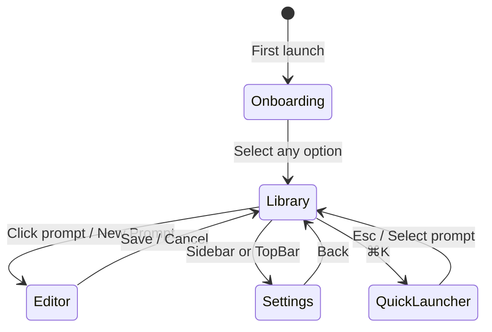

# Design Document: PromptDock UI Redesign

## Overview

This design covers a complete high-fidelity desktop UI redesign for PromptDock — a Tauri 2 + React + TypeScript + Vite + Tailwind CSS 4 application for storing, organizing, searching, filling, and quickly pasting reusable AI prompt recipes. The redesign replaces the existing functional-but-basic frontend with a polished, premium macOS-style productivity interface inspired by Raycast.

The UI layer is self-contained: all screens use mock data from a standalone TypeScript module, reusing the existing `PromptRecipe`, `Folder`, and related types from `src/types/index.ts`. No backend services, repositories, or Zustand stores are touched. React local state (`useState`/`useReducer`) manages all UI state. Integration points are marked with `TODO` comments for future backend wiring.

### Key Technical Decisions

- **Icons**: `lucide-react` (to be installed as a dependency)
- **Styling**: Tailwind CSS 4 with `@tailwindcss/vite` plugin (already configured), extended with CSS custom properties for design tokens
- **Components**: shadcn/ui-style reusable primitives (custom-built, not the actual shadcn library)
- **State**: React `useState`/`useReducer` only — no Zustand for the new UI layer
- **Data**: Static mock data module with 6 `PromptRecipe` objects and 4 `Folder` objects
- **Routing**: In-memory screen state managed by the `AppShell` component via `useReducer`

## Architecture

### High-Level Layout

The application follows a classic desktop productivity layout with five zones:

```
┌──────────────────────────────────────────────────────────┐
│                        TopBar                            │
│  [● ● ●]  PromptDock    [ 🔍 Search...  ⌘K ]   [⟳] [👤]│
├────────────┬─────────────────────────┬───────────────────┤
│  Sidebar   │    Main Content Area    │  Inspector Panel  │
│            │                         │   (optional)      │
│  Library   │   (active screen)       │                   │
│  Folders   │                         │                   │
│    Writing │                         │                   │
│    Product │                         │                   │
│    Eng.    │                         │                   │
│    Work    │                         │                   │
│  Tags      │                         │                   │
│  Workspace │                         │                   │
└────────────┴─────────────────────────┴───────────────────┘
```

### Screen Flow



### Component Tree

```
App (entry point — existing, will be replaced)
└── AppShell
    ├── TopBar
    │   ├── TrafficLights (macOS placeholder)
    │   ├── AppTitle
    │   ├── SearchBar (⌘K trigger)
    │   └── TopBarActions (sync badge, account icon)
    ├── Sidebar
    │   ├── SidebarSection ("Library")
    │   ├── SidebarSection ("Folders")
    │   │   └── SidebarItem × N (with counts)
    │   ├── SidebarSection ("Tags")
    │   └── SidebarSection ("Workspaces")
    ├── MainContentArea
    │   ├── OnboardingScreen
    │   │   ├── Card (welcome)
    │   │   ├── Card × 3 (options)
    │   │   └── Card × 4 (benefits)
    │   ├── LibraryScreen
    │   │   ├── LibraryHeader (title, count, view toggle, new button)
    │   │   ├── FilterChips (All, Favorites, Recent, Filters)
    │   │   └── PromptGrid
    │   │       └── PromptCard × N
    │   ├── EditorScreen
    │   │   ├── Breadcrumb
    │   │   ├── EditorForm
    │   │   │   ├── Input (title + char counter)
    │   │   │   ├── Input (description + char counter)
    │   │   │   ├── TagInput
    │   │   │   ├── Select (folder)
    │   │   │   ├── Toggle (favorite)
    │   │   │   └── BodyEditor (line numbers, variable highlighting)
    │   │   └── EditorPreview
    │   │       ├── RenderedPreview
    │   │       ├── VariableList
    │   │       └── TipsCard
    │   └── SettingsScreen
    │       ├── SettingsNav
    │       └── SettingsContent
    │           ├── AccountCard
    │           ├── SyncCard
    │           ├── AppearanceCard
    │           ├── HotkeyCard
    │           ├── DefaultBehaviorCard
    │           ├── ImportExportCard
    │           └── AboutCard
    ├── InspectorPanel (conditional, Library screen only)
    │   ├── PromptTitle + Description
    │   ├── MetadataList (folder, tags, dates)
    │   ├── BodyPreview (scrollable)
    │   └── VariableList
    ├── CommandPalette (modal overlay, ⌘K)
    │   ├── SearchInput
    │   └── ResultsList
    └── VariableFillModal (modal overlay, after prompt selection)
        ├── VariableInputs
        ├── RenderedPreview
        └── ActionButtons (Cancel, Paste, Copy)
```

### File Structure

```
src/
├── components/
│   ├── ui/                    # Base primitives (shadcn-style)
│   │   ├── Button.tsx
│   │   ├── Input.tsx
│   │   ├── Textarea.tsx
│   │   ├── Select.tsx
│   │   ├── Toggle.tsx
│   │   └── Card.tsx
│   ├── AppShell.tsx           # Root layout orchestrator
│   ├── TopBar.tsx
│   ├── Sidebar.tsx
│   ├── PromptCard.tsx         # Redesigned prompt card
│   ├── PromptGrid.tsx
│   ├── PromptInspector.tsx
│   ├── PromptEditor.tsx       # Redesigned editor
│   ├── VariableList.tsx
│   ├── VariableFillModal.tsx  # Redesigned variable fill
│   ├── CommandPalette.tsx
│   ├── OnboardingScreen.tsx
│   ├── SettingsScreen.tsx     # Redesigned settings
│   ├── SyncStatusBadge.tsx
│   ├── TagPill.tsx
│   ├── IconTile.tsx
│   └── EmptyState.tsx
├── data/
│   └── mock-data.ts           # Static mock data module
├── styles.css                 # Tailwind imports + CSS custom properties
└── types/
    └── index.ts               # Existing types (unchanged)
```

## Components and Interfaces

### Base UI Primitives (`src/components/ui/`)

These are shadcn/ui-style components — minimal wrappers around native HTML elements with consistent Tailwind styling. They do not use the actual shadcn library.

#### Button

```typescript
interface ButtonProps extends React.ButtonHTMLAttributes<HTMLButtonElement> {
  variant?: 'primary' | 'secondary' | 'ghost' | 'danger';
  size?: 'sm' | 'md' | 'lg';
  children: React.ReactNode;
}
```

Renders a `<button>` with rounded corners (`rounded-lg`), focus ring, and variant-specific colors. Primary uses `bg-[var(--color-primary)]`, secondary uses bordered style, ghost is transparent with hover background, danger uses red tones.

#### Input

```typescript
interface InputProps extends React.InputHTMLAttributes<HTMLInputElement> {
  label?: string;
  error?: string;
  hint?: string;
}
```

Renders a `<label>` + `<input>` pair with consistent border, focus ring, and optional error/hint text below.

#### Textarea

```typescript
interface TextareaProps extends React.TextareaHTMLAttributes<HTMLTextAreaElement> {
  label?: string;
  error?: string;
}
```

Same pattern as Input but for `<textarea>` elements.

#### Select

```typescript
interface SelectProps extends React.SelectHTMLAttributes<HTMLSelectElement> {
  label?: string;
  options: Array<{ value: string; label: string }>;
  placeholder?: string;
}
```

Renders a `<label>` + `<select>` with consistent styling.

#### Toggle

```typescript
interface ToggleProps {
  checked: boolean;
  onChange: (checked: boolean) => void;
  label: string;
  disabled?: boolean;
}
```

Renders a switch-style toggle using a `<button>` with `role="switch"` and `aria-checked`.

#### Card

```typescript
interface CardProps {
  children: React.ReactNode;
  className?: string;
  padding?: 'sm' | 'md' | 'lg';
}
```

Renders a `<div>` with white background, soft border, rounded corners (`rounded-xl`), and gentle shadow (`shadow-sm`).

### Layout Components

#### AppShell

```typescript
interface AppShellProps {
  children?: React.ReactNode;
}

// Internal state managed by useReducer
type Screen =
  | { name: 'onboarding' }
  | { name: 'library' }
  | { name: 'editor'; promptId?: string }
  | { name: 'settings' };

type AppAction =
  | { type: 'NAVIGATE'; screen: Screen }
  | { type: 'SELECT_PROMPT'; promptId: string | null }
  | { type: 'SET_SEARCH'; query: string }
  | { type: 'SET_FILTER'; filter: FilterType }
  | { type: 'TOGGLE_FAVORITE'; promptId: string }
  | { type: 'SET_SIDEBAR_ITEM'; item: string }
  | { type: 'OPEN_COMMAND_PALETTE' }
  | { type: 'CLOSE_COMMAND_PALETTE' };

interface AppState {
  screen: Screen;
  selectedPromptId: string | null;
  searchQuery: string;
  activeFilter: FilterType;
  activeSidebarItem: string;
  commandPaletteOpen: boolean;
  // Mock data references
  prompts: PromptRecipe[];
  folders: Folder[];
}
```

The root layout component. Orchestrates TopBar, Sidebar, MainContentArea, InspectorPanel, and modal overlays. Manages all navigation and shared UI state via `useReducer`. Registers the `⌘K` / `Ctrl+K` keyboard shortcut globally.

#### TopBar

```typescript
interface TopBarProps {
  searchQuery: string;
  onSearchChange: (query: string) => void;
  onCommandPaletteOpen: () => void;
  syncStatus?: SyncStatus;
}
```

Fixed at the top. Contains traffic light placeholders (three colored circles), "PromptDock" title, centered search bar with ⌘K hint, and sync/account icons using lucide-react (`RefreshCw`, `User`).

#### Sidebar

```typescript
interface SidebarProps {
  folders: Folder[];
  activeItem: string;
  onItemSelect: (item: string) => void;
  promptCountByFolder: Record<string, number>;
}
```

Left panel with sections: Library (home), Folders (with counts), Tags, Workspaces. Uses `<nav>` with `<button>` items. Selected item gets `bg-[var(--color-primary)]/10` background.

### Feature Components

#### PromptCard

```typescript
interface PromptCardProps {
  prompt: PromptRecipe;
  categoryColor: string;
  isSelected: boolean;
  onSelect: (id: string) => void;
  onToggleFavorite: (id: string) => void;
}
```

Displays: IconTile (colored category icon), title, truncated description, TagPills, relative timestamp, favorite star. Selected state shows blue border + checkmark. Hover shows subtle shadow elevation.

#### PromptGrid

```typescript
interface PromptGridProps {
  prompts: PromptRecipe[];
  selectedPromptId: string | null;
  onSelectPrompt: (id: string) => void;
  onToggleFavorite: (id: string) => void;
  categoryColorMap: Record<string, string>;
}
```

Two-column responsive grid (`grid-cols-1 md:grid-cols-2`) of PromptCards.

#### PromptInspector

```typescript
interface PromptInspectorProps {
  prompt: PromptRecipe;
  folder?: Folder;
  variables: string[];
}
```

Right-side detail panel. Shows full title, description, metadata (folder, tags, created/last used dates), scrollable body preview, and detected variable list. Uses `<aside>` element.

#### PromptEditor (redesigned)

```typescript
interface PromptEditorProps {
  promptId?: string;
  prompt?: PromptRecipe;
  folders: Folder[];
  onSave: (data: Partial<PromptRecipe>) => void;
  onCancel: () => void;
}
```

Two-column layout: left side has the form (title with char counter, description with char counter, tags with add/remove, folder select, favorite toggle, body editor with line numbers and variable highlighting, footer with word/char count). Right side has live preview panel with rendered body, detected variables list, and tips card.

#### CommandPalette

```typescript
interface CommandPaletteProps {
  prompts: PromptRecipe[];
  isOpen: boolean;
  onClose: () => void;
  onSelectPrompt: (prompt: PromptRecipe) => void;
}
```

Modal overlay with dimmed backdrop. Contains search input (auto-focused), filtered results list with keyboard navigation (↑↓ Enter Esc). Uses `<dialog>` element with `role="dialog"` and `aria-modal="true"`. Fade-in transition.

#### VariableFillModal (redesigned)

```typescript
interface VariableFillModalProps {
  prompt: PromptRecipe;
  variables: string[];
  onCancel: () => void;
  onCopy: (renderedText: string) => void;
  onPaste: (renderedText: string) => void;
}
```

Modal form adjacent to CommandPalette. Input fields for each variable, rendered preview, action buttons with keyboard hints (Esc cancel, ⌘V paste, ⌘↵ copy). Shows temporary "Copied!" success state on copy.

#### OnboardingScreen

```typescript
interface OnboardingScreenProps {
  onComplete: (choice: 'local' | 'sync' | 'signin') => void;
}
```

Centered welcome card with logo, heading, three option cards (Start locally, Enable sync, Sign in), four benefit cards, and privacy footer. All options navigate to Library.

#### SettingsScreen (redesigned)

```typescript
interface SettingsScreenProps {
  onBack: () => void;
}
```

Two-column layout: left nav column with section links, right content area with setting cards. Sections: Account & Sync, Appearance (Light/Dark/System cards + density), Hotkey (key capture input), Default Behavior, Import/Export, About.

### Utility Components

#### TagPill

```typescript
interface TagPillProps {
  tag: string;
  onRemove?: () => void;
}
```

Small rounded badge (`rounded-full`) with tag name. Optional remove button for editor context.

#### IconTile

```typescript
interface IconTileProps {
  icon: React.ReactNode;
  color: string; // CSS custom property name or hex
}
```

Small colored square with pastel background and centered lucide-react icon. Used in PromptCard and search results.

#### SyncStatusBadge

```typescript
interface SyncStatusBadgeProps {
  status: 'local' | 'synced' | 'offline';
}
```

Compact badge showing sync state with icon and text label. Uses lucide-react icons (`HardDrive`, `Cloud`, `WifiOff`).

#### EmptyState

```typescript
interface EmptyStateProps {
  icon: React.ReactNode;
  title: string;
  description: string;
  action?: { label: string; onClick: () => void };
}
```

Centered placeholder for empty lists/screens with icon, message, and optional CTA button.

#### VariableList

```typescript
interface VariableListProps {
  variables: string[];
}
```

Displays a list of detected `{{variable_name}}` placeholders extracted from a prompt body.

## Data Models

### Mock Data Module (`src/data/mock-data.ts`)

The mock data module is a standalone TypeScript file that exports static data for UI development. It imports only from `src/types/index.ts`.

```typescript
import type { PromptRecipe, Folder } from '../types/index';

// Category color mapping for IconTile backgrounds
export const CATEGORY_COLORS: Record<string, { bg: string; text: string; icon: string }> = {
  'summarize-text':   { bg: 'bg-purple-100', text: 'text-purple-600', icon: 'FileText' },
  'rewrite':          { bg: 'bg-green-100',  text: 'text-green-600',  icon: 'Pencil' },
  'ideas':            { bg: 'bg-amber-100',  text: 'text-amber-600',  icon: 'Lightbulb' },
  'code-review':      { bg: 'bg-blue-100',   text: 'text-blue-600',   icon: 'Code' },
  'email-draft':      { bg: 'bg-rose-100',   text: 'text-rose-600',   icon: 'Mail' },
  'meeting-notes':    { bg: 'bg-teal-100',   text: 'text-teal-600',   icon: 'ClipboardList' },
};

export const MOCK_FOLDERS: Folder[] = [
  { id: 'folder-writing',     name: 'Writing',     createdAt: new Date(), updatedAt: new Date() },
  { id: 'folder-product',     name: 'Product',     createdAt: new Date(), updatedAt: new Date() },
  { id: 'folder-engineering', name: 'Engineering', createdAt: new Date(), updatedAt: new Date() },
  { id: 'folder-work',        name: 'Work',        createdAt: new Date(), updatedAt: new Date() },
];

export const MOCK_PROMPTS: PromptRecipe[] = [
  {
    id: 'prompt-summarize',
    workspaceId: 'local',
    title: 'Summarize Text',
    description: 'Condense long text into a concise summary at a chosen detail level.',
    body: 'Summarize the following text for a {{audience}} audience...\n\nText:\n{{text}}\n\nFormat: {{format}}',
    tags: ['summarization', 'writing'],
    folderId: 'folder-writing',
    favorite: true,
    archived: false,
    archivedAt: null,
    createdAt: new Date('2024-11-15'),
    updatedAt: new Date('2024-12-01'),
    lastUsedAt: new Date('2024-12-20'),
    createdBy: 'local',
    version: 1,
  },
  // ... 5 more prompts (Rewrite, Ideas, Code Review, Email Draft, Meeting Notes)
];

// Prompt-to-category mapping for color lookup
export const PROMPT_CATEGORY_MAP: Record<string, string> = {
  'prompt-summarize':     'summarize-text',
  'prompt-rewrite':       'rewrite',
  'prompt-ideas':         'ideas',
  'prompt-code-review':   'code-review',
  'prompt-email-draft':   'email-draft',
  'prompt-meeting-notes': 'meeting-notes',
};
```

### Design Token System

Design tokens are defined as CSS custom properties in `src/styles.css` and referenced via Tailwind's `var()` syntax. This enables future dark theme support by overriding the custom properties under a `.dark` class or `prefers-color-scheme` media query.

```css
@import "tailwindcss";

:root {
  /* Primary */
  --color-primary: #2563EB;
  --color-primary-hover: #1D4ED8;
  --color-primary-light: #EFF6FF;

  /* Surfaces */
  --color-background: #F8FAFC;
  --color-panel: #FFFFFF;
  --color-border: #E5E7EB;

  /* Text */
  --color-text-main: #0F172A;
  --color-text-muted: #64748B;
  --color-text-placeholder: #94A3B8;

  /* Category colors */
  --color-cat-purple: #F3E8FF;
  --color-cat-green: #DCFCE7;
  --color-cat-amber: #FEF3C7;
  --color-cat-blue: #DBEAFE;
  --color-cat-rose: #FFE4E6;
  --color-cat-teal: #CCFBF1;

  /* Spacing (maps to Tailwind scale) */
  --space-xs: 0.25rem;   /* 4px */
  --space-sm: 0.5rem;    /* 8px */
  --space-md: 1rem;      /* 16px */
  --space-lg: 1.5rem;    /* 24px */
  --space-xl: 2rem;      /* 32px */

  /* Typography */
  --font-sans: 'Inter', system-ui, -apple-system, sans-serif;
  --font-mono: 'JetBrains Mono', 'Fira Code', ui-monospace, monospace;

  /* Radii */
  --radius-sm: 0.375rem;  /* 6px */
  --radius-md: 0.5rem;    /* 8px */
  --radius-lg: 0.75rem;   /* 12px */
  --radius-xl: 1rem;      /* 16px */
}

/* Future dark theme placeholder */
/* .dark { --color-background: #0F172A; --color-panel: #1E293B; ... } */
```

### State Management

All UI state is managed by a single `useReducer` in the `AppShell` component. No Zustand stores are used for the new UI layer.

```typescript
type FilterType = 'all' | 'favorites' | 'recent';

interface AppState {
  screen: Screen;
  selectedPromptId: string | null;
  searchQuery: string;
  activeFilter: FilterType;
  activeSidebarItem: string;
  commandPaletteOpen: boolean;
  variableFillPromptId: string | null;
}

type AppAction =
  | { type: 'NAVIGATE'; screen: Screen }
  | { type: 'SELECT_PROMPT'; promptId: string | null }
  | { type: 'SET_SEARCH'; query: string }
  | { type: 'SET_FILTER'; filter: FilterType }
  | { type: 'TOGGLE_FAVORITE'; promptId: string }
  | { type: 'SET_SIDEBAR_ITEM'; item: string }
  | { type: 'OPEN_COMMAND_PALETTE' }
  | { type: 'CLOSE_COMMAND_PALETTE' }
  | { type: 'OPEN_VARIABLE_FILL'; promptId: string }
  | { type: 'CLOSE_VARIABLE_FILL' };
```

The reducer is a pure function that returns a new `AppState` for each action. Mock data (`MOCK_PROMPTS`, `MOCK_FOLDERS`) is loaded once at `AppShell` mount and stored in a `useRef` or top-level constant — it never changes.

### Filtering and Search Logic

Search and filtering are computed via `useMemo` inside the `AppShell` or `LibraryScreen`:

1. **Search**: Case-insensitive substring match against `title`, `description`, and `tags` fields
2. **Filter chips**: "All" (no filter), "Favorites" (`favorite === true`), "Recent" (sorted by `lastUsedAt` descending, top N)
3. **Sidebar folder filter**: Match `folderId` against selected folder
4. **Combined**: Search → Filter chip → Folder filter (applied in sequence)

### Keyboard Interaction Map

| Shortcut | Context | Action |
|----------|---------|--------|
| `⌘K` / `Ctrl+K` | Global | Open Command Palette |
| `Escape` | Command Palette open | Close Command Palette |
| `Escape` | Variable Fill Modal open | Close Variable Fill Modal |
| `↑` / `↓` | Command Palette results | Navigate highlighted result |
| `Enter` | Command Palette result highlighted | Select prompt |
| `⌘↵` / `Ctrl+Enter` | Variable Fill Modal | Copy final prompt |
| `Tab` | Any screen | Move focus to next interactive element |

Keyboard shortcuts are registered via `useEffect` with `keydown` event listeners on `window`. The `⌘K` handler calls `e.preventDefault()` to avoid browser default behavior.


## Correctness Properties

*A property is a characteristic or behavior that should hold true across all valid executions of a system — essentially, a formal statement about what the system should do. Properties serve as the bridge between human-readable specifications and machine-verifiable correctness guarantees.*

### Property 1: Navigation reducer produces valid screen state

*For any* valid `AppState` and any valid `AppAction`, applying the reducer should produce a new `AppState` where the `screen` field is one of the defined screen types (`onboarding`, `library`, `editor`, `settings`), the `selectedPromptId` is either `null` or a string, and all other state fields remain within their valid domains. Specifically, navigating to `editor` with a `promptId` should preserve that ID in the resulting screen state, and dispatching `SELECT_PROMPT` should update `selectedPromptId` to the dispatched value.

**Validates: Requirements 2.5, 12.1, 12.2, 12.4**

### Property 2: Search filtering returns only matching prompts

*For any* non-empty search query string and any list of `PromptRecipe` objects, every prompt returned by the search filter should contain the query as a case-insensitive substring in at least one of: `title`, `description`, or `tags`. Conversely, no non-archived prompt that matches the query in any of those fields should be excluded from the results.

**Validates: Requirements 5.4, 7.4, 12.5**

### Property 3: Favorites filter returns only favorited prompts

*For any* list of `PromptRecipe` objects, applying the favorites filter should return exactly the subset of prompts where `favorite === true`. The length of the filtered list should be less than or equal to the original list length, and every prompt in the filtered list should have `favorite === true`.

**Validates: Requirements 5.5**

### Property 4: Variable extraction from template strings

*For any* template string containing zero or more `{{variable_name}}` placeholders, the variable extraction function should return exactly the set of unique variable names present in the template, in first-appearance order. Splitting the template by variables and rejoining the segments should reconstruct the original string (round-trip property).

**Validates: Requirements 6.3, 6.6, 6.8**

### Property 5: Word count and character count correctness

*For any* non-empty string, the character count should equal the string's `.length` property, and the word count should equal the number of non-empty tokens produced by splitting on whitespace. For an empty string, both counts should be zero.

**Validates: Requirements 6.4**

### Property 6: State preservation across editor round-trip navigation

*For any* `AppState` with a non-empty `searchQuery` and any `activeFilter` value, navigating from the library screen to the editor screen and then back to the library screen should preserve the original `searchQuery` and `activeFilter` values unchanged.

**Validates: Requirements 12.3**

### Property 7: Arrow key navigation stays within bounds

*For any* list of N search results (N ≥ 1) and any sequence of ↑/↓ key presses, the highlighted index should always remain in the range [0, N-1]. Pressing ↓ when at index N-1 should not increase the index, and pressing ↑ when at index 0 should not decrease it.

**Validates: Requirements 10.3**

### Property 8: Variable fill modal appears if and only if prompt has variables

*For any* `PromptRecipe`, selecting it in the Command Palette should display the Variable Fill Modal if and only if the prompt's `body` field contains at least one `{{variable_name}}` placeholder. Prompts with no variables should proceed directly to the copy/paste action without showing the modal.

**Validates: Requirements 7.5**

## Error Handling

### User Input Errors

| Scenario | Handling |
|----------|----------|
| Empty search query | Show all non-archived prompts (no error state) |
| No search results | Display `EmptyState` component with "No prompts match your search" message and suggestion to clear filters |
| Editor: empty title on save | Show inline validation error below the title field; prevent save |
| Editor: empty body on save | Show inline validation error below the body editor; prevent save |
| Variable Fill: missing variable values | Disable "Copy" and "Paste" buttons; show "Fill in all variables" hint in preview area |

### Navigation Errors

| Scenario | Handling |
|----------|----------|
| Navigate to editor with invalid prompt ID | Show `EmptyState` with "Prompt not found" message and back button |
| Unknown screen state in reducer | Default case returns current state unchanged (no crash) |

### Keyboard Interaction Errors

| Scenario | Handling |
|----------|----------|
| ⌘K pressed when Command Palette already open | No-op (palette stays open, focus remains on search input) |
| Arrow keys with empty results list | No-op (highlight index stays at 0) |
| Enter with no highlighted result | No-op |

### Integration Point Errors (Future)

All integration points are marked with `TODO` comments. Current mock implementations:
- **Clipboard operations**: No-op with `// TODO: wire to Tauri clipboard command`
- **Backend persistence**: Mock data is read-only with `// TODO: replace with repository call`
- **Firebase auth**: Placeholder UI with `// TODO: wire to AuthService`
- **Global hotkey**: Event listener only with `// TODO: register via Tauri global shortcut plugin`

## Testing Strategy

### Testing Approach

This feature uses a dual testing approach:

1. **Property-based tests** (using `fast-check`, already in devDependencies): Verify universal properties across generated inputs — search filtering, state reducer correctness, variable extraction, navigation state preservation
2. **Example-based unit tests** (using `vitest`, already configured): Verify specific rendering, interactions, and edge cases for each component and screen

### Property-Based Tests

Library: `fast-check` (already installed at version 4.1.1)
Runner: `vitest` (already configured)
Minimum iterations: 100 per property

Each property test references its design document property:

| Test File | Property | Tag |
|-----------|----------|-----|
| `src/components/__tests__/app-reducer.property.test.ts` | Property 1 | Feature: prompt-dock-ui, Property 1: Navigation reducer produces valid screen state |
| `src/components/__tests__/search-filter.property.test.ts` | Property 2 | Feature: prompt-dock-ui, Property 2: Search filtering returns only matching prompts |
| `src/components/__tests__/favorites-filter.property.test.ts` | Property 3 | Feature: prompt-dock-ui, Property 3: Favorites filter returns only favorited prompts |
| `src/components/__tests__/variable-extraction.property.test.ts` | Property 4 | Feature: prompt-dock-ui, Property 4: Variable extraction from template strings |
| `src/components/__tests__/text-counts.property.test.ts` | Property 5 | Feature: prompt-dock-ui, Property 5: Word count and character count correctness |
| `src/components/__tests__/navigation-state.property.test.ts` | Property 6 | Feature: prompt-dock-ui, Property 6: State preservation across editor round-trip |
| `src/components/__tests__/arrow-navigation.property.test.ts` | Property 7 | Feature: prompt-dock-ui, Property 7: Arrow key navigation stays within bounds |
| `src/components/__tests__/variable-fill-condition.property.test.ts` | Property 8 | Feature: prompt-dock-ui, Property 8: Variable fill modal appears iff prompt has variables |

### Example-Based Unit Tests

| Component/Screen | Key Test Cases |
|-----------------|----------------|
| `Button` | Renders all variants, handles click, shows disabled state |
| `Input` | Renders label, shows error, handles change |
| `Toggle` | Toggles on click, respects disabled, has correct ARIA |
| `Card` | Renders children, applies padding variants |
| `AppShell` | Renders TopBar + Sidebar + MainContent, ⌘K opens palette |
| `TopBar` | Renders traffic lights, search bar, ⌘K hint |
| `Sidebar` | Renders sections, highlights selected item, shows folder counts |
| `PromptCard` | Renders all fields, toggles favorite, shows selected state |
| `PromptGrid` | Renders cards in grid, handles empty state |
| `PromptInspector` | Shows prompt details, lists variables |
| `CommandPalette` | Auto-focuses input, filters results, keyboard navigation |
| `VariableFillModal` | Renders variable inputs, shows preview, copy success state |
| `OnboardingScreen` | Renders 3 options + 4 benefits, navigates on click |
| `LibraryScreen` | Renders header + filters + grid, search filters in real time |
| `EditorScreen` | Renders form + preview, variable highlighting, char/word counts |
| `SettingsScreen` | Renders nav + cards, scrolls to section on nav click |
| `Mock Data` | Contains 6 prompts, 4 folders, all have valid structure |

### Accessibility Tests

- Verify all modals have `role="dialog"` and `aria-modal="true"`
- Verify icon-only buttons have `aria-label`
- Verify form inputs have associated `<label>` elements or `aria-label`
- Verify `aria-selected` on selectable items (sidebar, command palette results)
- Verify `aria-expanded` on expandable controls
- Verify focus management: Command Palette auto-focuses search, Escape returns focus

### Integration Test Considerations (Future)

When backend integration is added, the following integration tests should be created:
- Clipboard copy/paste via Tauri commands
- Global hotkey registration and window management
- Firebase authentication flow
- Sync status updates from real sync service
- Data persistence round-trip through repositories
