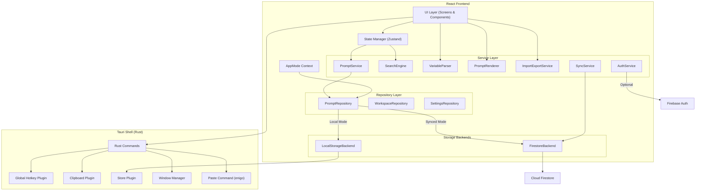
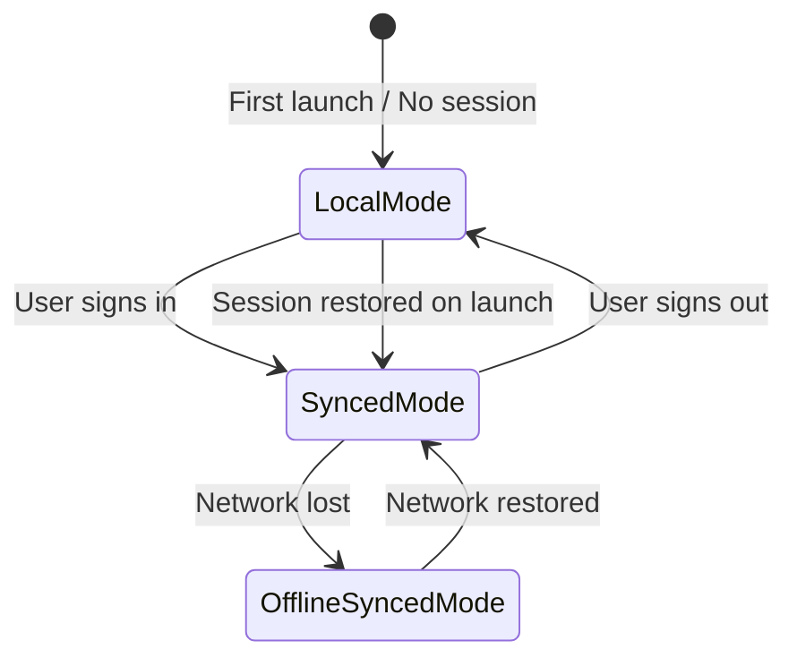
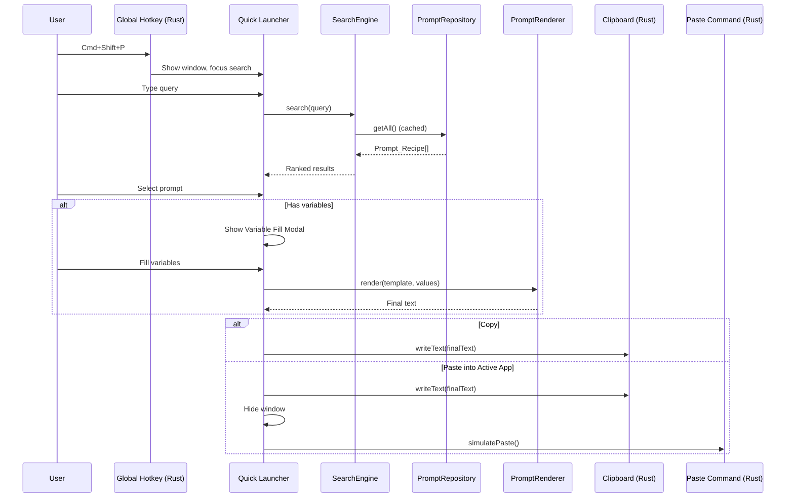

# Design Document — PromptDock

## Overview

PromptDock is a local-first, cross-platform desktop prompt recipe manager built with Tauri 2 (Rust backend), React + TypeScript (frontend), Vite (build), and Tailwind CSS (styling). The app launches directly into a fully functional local experience — no account required. Users can create, edit, search, and use prompt templates with variable substitution, all persisted to local disk via the Tauri Store plugin. Optional sign-in (Firebase Auth) enables cross-device sync through Cloud Firestore with offline persistence.

The architecture follows a repository pattern with a unified `PromptRepository` interface that delegates to either a `LocalStorageBackend` or a `FirestoreBackend` depending on the current application mode. This abstraction keeps the UI and business logic mode-agnostic.

Key design decisions:
- **Local-first by default**: The app is fully functional without any network or account. Firebase is loaded lazily only when the user opts into sync.
- **Repository abstraction**: A single `PromptRepository` interface with swappable backends (local JSON files vs. Firestore) keeps components decoupled from storage details.
- **Tauri 2 plugins for native features**: Global hotkey (`@tauri-apps/plugin-global-shortcut`), clipboard (`@tauri-apps/plugin-clipboard-manager`), persistent key-value store (`@tauri-apps/plugin-store`), and window management via Tauri's built-in window APIs.
- **Paste via Rust command**: Programmatic paste into the active app is implemented as a Tauri Rust command using OS-level keyboard simulation (enigo crate on all platforms).
- **Lazy Firebase initialization**: Firebase SDK is not imported or initialized until the user explicitly signs in, keeping the local-mode bundle lean.

## Architecture

### High-Level Architecture



### Application Mode State Machine



### Data Flow — Quick Launcher



## Components and Interfaces

### Core Service Interfaces

```typescript
// --- Application Mode ---
type AppMode = 'local' | 'synced' | 'offline-synced';

interface AppModeState {
  mode: AppMode;
  userId: string | null;
  isOnline: boolean;
}

// --- Repository Interface (unified for both backends) ---
interface IPromptRepository {
  create(recipe: Omit<PromptRecipe, 'id' | 'createdAt' | 'updatedAt'>): Promise<PromptRecipe>;
  getById(id: string): Promise<PromptRecipe | null>;
  getAll(workspaceId: string): Promise<PromptRecipe[]>;
  update(id: string, changes: Partial<PromptRecipe>): Promise<PromptRecipe>;
  softDelete(id: string): Promise<void>;
  restore(id: string): Promise<void>;
  duplicate(id: string): Promise<PromptRecipe>;
  toggleFavorite(id: string): Promise<PromptRecipe>;
}

interface IWorkspaceRepository {
  create(workspace: Omit<Workspace, 'id' | 'createdAt' | 'updatedAt'>): Promise<Workspace>;
  getById(id: string): Promise<Workspace | null>;
  listForUser(userId: string): Promise<Workspace[]>;
  update(id: string, changes: Partial<Workspace>): Promise<Workspace>;
}

interface ISettingsRepository {
  get(): Promise<UserSettings>;
  update(changes: Partial<UserSettings>): Promise<UserSettings>;
}

// --- Variable Parser ---
interface IVariableParser {
  /** Extract unique variable names in order of first appearance */
  parse(template: string): string[];
}

// --- Prompt Renderer ---
interface IPromptRenderer {
  /**
   * Substitute variables into template.
   * Returns rendered text or validation error with missing variable names.
   */
  render(template: string, values: Record<string, string>): RenderResult;
}

type RenderResult =
  | { success: true; text: string }
  | { success: false; missingVariables: string[] };

// --- Search Engine ---
interface ISearchEngine {
  /**
   * Search prompts by query. Returns ranked results.
   * Empty query returns all non-archived prompts.
   */
  search(prompts: PromptRecipe[], query: string): PromptRecipe[];
}

// --- Import/Export ---
interface IImportExportService {
  exportToJSON(prompts: PromptRecipe[]): string;
  importFromJSON(json: string): ImportResult;
  detectDuplicates(incoming: PromptRecipe[], existing: PromptRecipe[]): DuplicateInfo[];
}

type ImportResult =
  | { success: true; prompts: PromptRecipe[] }
  | { success: false; errors: string[] };

interface DuplicateInfo {
  incoming: PromptRecipe;
  existing: PromptRecipe;
  matchedOn: 'title' | 'body' | 'both';
}

// --- Auth Service (optional, for sync) ---
interface IAuthService {
  signUp(email: string, password: string): Promise<AuthResult>;
  signIn(email: string, password: string): Promise<AuthResult>;
  signOut(): Promise<void>;
  restoreSession(): Promise<AuthResult | null>;
  sendPasswordReset(email: string): Promise<void>;
  onAuthStateChanged(callback: (user: AuthUser | null) => void): () => void;
}

type AuthResult =
  | { success: true; user: AuthUser }
  | { success: false; error: AuthError };

type AuthError = 'invalid-credentials' | 'email-in-use' | 'weak-password' | 'unknown';

interface AuthUser {
  uid: string;
  email: string;
  displayName: string | null;
}
```

### Tauri Rust Commands

```rust
// src-tauri/src/commands.rs

/// Register a global hotkey. Called on app startup.
#[tauri::command]
fn register_hotkey(app: tauri::AppHandle, shortcut: String) -> Result<(), String>;

/// Unregister the current global hotkey.
#[tauri::command]
fn unregister_hotkey(app: tauri::AppHandle) -> Result<(), String>;

/// Copy text to the system clipboard.
#[tauri::command]
fn copy_to_clipboard(app: tauri::AppHandle, text: String) -> Result<(), String>;

/// Simulate Cmd+V / Ctrl+V paste into the currently active application.
/// Uses the `enigo` crate for cross-platform keyboard simulation.
#[tauri::command]
fn paste_to_active_app() -> Result<(), String>;

/// Show or hide the quick launcher window.
#[tauri::command]
fn toggle_quick_launcher(app: tauri::AppHandle) -> Result<(), String>;

/// Show the main application window.
#[tauri::command]
fn show_main_window(app: tauri::AppHandle) -> Result<(), String>;

/// Hide the main application window (minimize to tray).
#[tauri::command]
fn hide_main_window(app: tauri::AppHandle) -> Result<(), String>;
```

### React Component Tree

```
App
├── AppModeProvider (context: mode, userId, isOnline)
│   ├── MainLibraryScreen
│   │   ├── SyncStatusBar
│   │   ├── SearchBar
│   │   ├── FolderSidebar
│   │   ├── PromptList
│   │   │   └── PromptCard (title, description, tags, favorite, lastUsed)
│   │   └── ConflictBadge (Synced Mode only)
│   ├── PromptEditor
│   │   ├── TitleInput
│   │   ├── DescriptionInput
│   │   ├── BodyEditor (with variable highlighting)
│   │   ├── TagInput
│   │   └── FolderSelect
│   ├── SettingsScreen
│   │   ├── AccountSection (sign-in/sign-up forms or account info)
│   │   ├── HotkeyConfig
│   │   ├── ThemeSelector
│   │   ├── DefaultActionSelector
│   │   ├── WorkspaceSwitcher (Synced Mode only)
│   │   ├── ImportExportSection
│   │   └── SyncStatusSection
│   ├── ConflictCenter (Synced Mode only)
│   │   └── ConflictItem (side-by-side diff)
│   └── VariableFillModal
│       ├── VariableInput (per variable)
│       ├── RenderedPreview
│       └── ActionButtons (Copy, Paste, Copy & Close)
└── QuickLauncherWindow (separate Tauri window)
    ├── SearchInput (auto-focused)
    ├── ResultsList
    └── VariableFillModal (inline)
```

### State Management (Zustand)

```typescript
// Main store slices
interface PromptStore {
  prompts: PromptRecipe[];
  activeWorkspaceId: string;
  selectedPromptId: string | null;
  searchQuery: string;
  folderFilter: string | null;
  favoriteFilter: boolean;
  
  // Actions
  loadPrompts: () => Promise<void>;
  createPrompt: (data: CreatePromptData) => Promise<void>;
  updatePrompt: (id: string, changes: Partial<PromptRecipe>) => Promise<void>;
  deletePrompt: (id: string) => Promise<void>;
  duplicatePrompt: (id: string) => Promise<void>;
  toggleFavorite: (id: string) => Promise<void>;
  archivePrompt: (id: string) => Promise<void>;
  restorePrompt: (id: string) => Promise<void>;
  setSearchQuery: (query: string) => void;
  setFolderFilter: (folderId: string | null) => void;
  setFavoriteFilter: (enabled: boolean) => void;
}

interface AppModeStore {
  mode: AppMode;
  userId: string | null;
  isOnline: boolean;
  syncStatus: SyncStatus;
  lastSyncedAt: Date | null;
  
  setMode: (mode: AppMode) => void;
  setUserId: (userId: string | null) => void;
  setOnline: (online: boolean) => void;
  setSyncStatus: (status: SyncStatus) => void;
}

interface SettingsStore {
  settings: UserSettings;
  loadSettings: () => Promise<void>;
  updateSettings: (changes: Partial<UserSettings>) => Promise<void>;
}
```

## Data Models

### TypeScript Interfaces

```typescript
interface PromptRecipe {
  id: string;
  workspaceId: string;
  title: string;
  description: string;
  body: string;
  tags: string[];
  folderId: string | null;
  favorite: boolean;
  archived: boolean;
  archivedAt: Date | null;
  createdAt: Date;
  updatedAt: Date;
  lastUsedAt: Date | null;
  createdBy: string; // 'local' in Local Mode, userId in Synced Mode
  version: number;
}

interface PromptVariable {
  name: string;
  defaultValue: string;
  description: string;
}

interface Workspace {
  id: string;
  name: string;
  ownerId: string; // 'local' in Local Mode
  createdAt: Date;
  updatedAt: Date;
}

interface WorkspaceMember {
  id: string;
  workspaceId: string;
  userId: string;
  role: 'owner' | 'editor' | 'viewer';
  joinedAt: Date;
}

interface UserSettings {
  hotkeyCombo: string; // e.g. 'CommandOrControl+Shift+P'
  theme: 'light' | 'dark' | 'system';
  defaultAction: 'copy' | 'paste';
  activeWorkspaceId: string;
}

interface PromptConflict {
  id: string;
  promptId: string;
  localVersion: PromptRecipe;
  remoteVersion: PromptRecipe;
  detectedAt: Date;
  resolvedAt: Date | null;
}

type SyncStatus = 'local' | 'synced' | 'syncing' | 'offline' | 'pending-changes';
```

### Firestore Collections (Synced Mode only)

```
/users/{userId}
  - uid: string
  - email: string
  - displayName: string
  - createdAt: Timestamp

/workspaces/{workspaceId}
  - name: string
  - ownerId: string
  - createdAt: Timestamp
  - updatedAt: Timestamp

/workspaces/{workspaceId}/members/{memberId}
  - userId: string
  - role: 'owner' | 'editor' | 'viewer'
  - joinedAt: Timestamp

/workspaces/{workspaceId}/prompts/{promptId}
  - title: string
  - description: string
  - body: string
  - tags: string[]
  - folderId: string | null
  - favorite: boolean
  - archived: boolean
  - archivedAt: Timestamp | null
  - createdAt: Timestamp
  - updatedAt: Timestamp
  - lastUsedAt: Timestamp | null
  - createdBy: string
  - version: number

/workspaces/{workspaceId}/folders/{folderId}
  - name: string
  - createdAt: Timestamp
  - updatedAt: Timestamp

/workspaces/{workspaceId}/prompts/{promptId}/versions/{versionId}
  - body: string
  - updatedAt: Timestamp
  - updatedBy: string

/workspaces/{workspaceId}/conflicts/{conflictId}
  - promptId: string
  - localVersion: map
  - remoteVersion: map
  - detectedAt: Timestamp
  - resolvedAt: Timestamp | null

/settings/{userId}
  - hotkeyCombo: string
  - theme: string
  - defaultAction: string
  - activeWorkspaceId: string
```

### Local Storage Structure (Local Mode)

The Tauri Store plugin persists data as JSON in the app data directory:

```
{appDataDir}/
├── prompts.json        # Array of PromptRecipe objects
├── folders.json        # Array of Folder objects
├── settings.json       # UserSettings object
└── workspace.json      # Default local Workspace object
```

Each file is read on startup and written on every mutation. The `LocalStorageBackend` uses `@tauri-apps/plugin-store` for atomic read/write operations.

### Import/Export JSON Schema

```json
{
  "$schema": "http://json-schema.org/draft-07/schema#",
  "type": "object",
  "required": ["version", "exportedAt", "prompts"],
  "properties": {
    "version": { "type": "string", "const": "1.0" },
    "exportedAt": { "type": "string", "format": "date-time" },
    "prompts": {
      "type": "array",
      "items": {
        "type": "object",
        "required": ["title", "body"],
        "properties": {
          "title": { "type": "string" },
          "description": { "type": "string" },
          "body": { "type": "string" },
          "tags": { "type": "array", "items": { "type": "string" } },
          "folderId": { "type": ["string", "null"] },
          "favorite": { "type": "boolean" },
          "createdAt": { "type": "string", "format": "date-time" },
          "updatedAt": { "type": "string", "format": "date-time" }
        }
      }
    }
  }
}
```


## Correctness Properties

*A property is a characteristic or behavior that should hold true across all valid executions of a system — essentially, a formal statement about what the system should do. Properties serve as the bridge between human-readable specifications and machine-verifiable correctness guarantees.*

### Property 1: Local Storage Round-Trip

*For any* valid `PromptRecipe` object, writing it to `LocalStorage` and reading it back SHALL produce an object deeply equal to the original.

**Validates: Requirements 1.2, 6.1, 6.5**

### Property 2: Firestore Converter Round-Trip

*For any* valid `PromptRecipe` TypeScript object, converting it to a Firestore document via the data converter and converting back SHALL produce an object deeply equal to the original.

**Validates: Requirements 7.7, 7.8**

### Property 3: Archive/Restore Round-Trip

*For any* non-archived `PromptRecipe`, archiving it SHALL set `archived` to `true` and `archivedAt` to a non-null timestamp, and subsequently restoring it SHALL set `archived` to `false` and `archivedAt` to `null`, returning the recipe to its original archived state.

**Validates: Requirements 7.6, 11.6, 11.7**

### Property 4: Variable Parser Extracts Unique Variables in First-Appearance Order

*For any* template string containing `{{variable_name}}` placeholders (including duplicates), the `Variable_Parser` SHALL return exactly the set of unique variable names, ordered by their first appearance in the template.

**Validates: Requirements 12.1, 12.2, 12.4**

### Property 5: Variable Parser Case Sensitivity

*For any* template string containing variable placeholders that differ only in letter casing (e.g., `{{Name}}` and `{{name}}`), the `Variable_Parser` SHALL treat them as distinct variables and return both.

**Validates: Requirements 12.3**

### Property 6: Variable Parser Round-Trip

*For any* template string, extracting variables with the `Variable_Parser` and then reconstructing a template containing those variables as `{{name}}` placeholders SHALL yield a template from which re-extraction produces the same set of variable names.

**Validates: Requirements 12.6**

### Property 7: Prompt Rendering No-Placeholder

*For any* template string and a complete variable value map (a value provided for every detected variable), rendering the template with the `Prompt_Renderer` SHALL produce output containing none of the original `{{variable_name}}` placeholders.

**Validates: Requirements 13.1, 13.3, 13.5**

### Property 8: Prompt Rendering Identity for Variable-Free Templates

*For any* template string that contains no `{{variable_name}}` placeholders, rendering it with the `Prompt_Renderer` (with an empty value map) SHALL return text identical to the input template.

**Validates: Requirements 13.4, 13.6**

### Property 9: Prompt Rendering Missing Variable Error

*For any* template string with at least one variable and an incomplete value map (at least one variable missing), the `Prompt_Renderer` SHALL return a validation error whose `missingVariables` list contains exactly the variable names not present in the value map.

**Validates: Requirements 13.2**

### Property 10: Search Excludes Archived Prompts

*For any* collection of `PromptRecipe` objects (some archived, some not) and *for any* search query (including empty), the `Search_Engine` SHALL return results that contain no archived prompts, and when the query is empty, the results SHALL contain all non-archived prompts.

**Validates: Requirements 14.3, 14.5**

### Property 11: Search Case Insensitivity

*For any* collection of `PromptRecipe` objects and *for any* search query string, searching with the query in all-uppercase SHALL return the same set of results as searching with the query in all-lowercase.

**Validates: Requirements 14.4**

### Property 12: Search Recall for Exact Title Match

*For any* non-archived `PromptRecipe` in the collection, searching with a query string equal to that recipe's exact title SHALL include that recipe in the results.

**Validates: Requirements 14.6**

### Property 13: Search Ranking by Field Priority

*For any* search query that matches one `PromptRecipe` only in the title and another only in the body, the title-matched recipe SHALL appear before the body-matched recipe in the results.

**Validates: Requirements 14.2**

### Property 14: Update Sets updatedAt Timestamp

*For any* existing `PromptRecipe` and *for any* valid partial update, applying the update via the `Prompt_Repository` SHALL produce a recipe whose `updatedAt` timestamp is strictly greater than the original `updatedAt`.

**Validates: Requirements 11.3**

### Property 15: Duplicate Prefixes Title

*For any* `PromptRecipe`, duplicating it via the `Prompt_Repository` SHALL produce a new recipe with a title equal to `"Copy of " + originalTitle` and a different `id`.

**Validates: Requirements 11.4**

### Property 16: Favorite Toggle Flips Boolean

*For any* `PromptRecipe`, toggling the favorite flag SHALL produce a recipe whose `favorite` value is the logical negation of the original.

**Validates: Requirements 11.5**

### Property 17: Import/Export Round-Trip

*For any* collection of non-archived `PromptRecipe` objects, exporting them to JSON and then importing the resulting JSON into an empty workspace SHALL produce a collection of recipes equivalent to the originals (matching on title, description, body, tags).

**Validates: Requirements 19.5**

### Property 18: Export Produces Valid Schema JSON

*For any* collection of valid `PromptRecipe` objects, exporting them SHALL produce a JSON string that, when parsed, conforms to the PromptDock export schema (has `version`, `exportedAt`, and `prompts` array with required fields).

**Validates: Requirements 19.6**

### Property 19: Export Contains All Non-Archived Prompts

*For any* collection of `PromptRecipe` objects (some archived, some not), exporting SHALL produce a JSON document whose `prompts` array contains exactly the non-archived recipes from the input collection.

**Validates: Requirements 19.1**

### Property 20: Import Schema Validation Rejects Invalid JSON

*For any* JSON string that does not conform to the PromptDock export schema (missing required fields, wrong types, or malformed structure), the `Import_Export_Service` SHALL return a validation error with a non-empty list of schema violations.

**Validates: Requirements 19.2**

### Property 21: Import Duplicate Detection

*For any* pair of `PromptRecipe` collections (incoming and existing) where at least one incoming recipe shares a title and body with an existing recipe, the `Import_Export_Service.detectDuplicates` SHALL return a non-empty list identifying the matching pairs.

**Validates: Requirements 19.4**

## Error Handling

### Storage Errors

| Error Scenario | Handling Strategy |
|---|---|
| Local Storage file corrupted or unreadable | Log error, initialize with empty collection, notify user that data could not be loaded. Preserve corrupted file as `.backup` for manual recovery. |
| Local Storage write failure (disk full, permissions) | Retry once, then display error notification. Keep in-memory state consistent. |
| Firestore read/write failure (network) | Firestore SDK handles offline queueing automatically. Display "Offline" sync status. |
| Firestore permission denied | Display error indicating the user lacks access. Prompt re-authentication if token expired. |

### Authentication Errors

| Error Scenario | Handling Strategy |
|---|---|
| Invalid credentials on sign-in | Display "Email or password is incorrect" error message. |
| Email already in use on sign-up | Display "This email is already registered" error message. |
| Weak password on sign-up | Display "Password does not meet strength requirements" with specific guidance. |
| Session restore failure | Silently fall back to Local Mode. No error displayed — user simply sees local prompts. |
| Network unavailable during sign-in | Display "Unable to connect. Check your internet connection." |

### Prompt Operations Errors

| Error Scenario | Handling Strategy |
|---|---|
| Missing required variables on render | Return `RenderResult` with `success: false` and list of missing variable names. UI highlights missing fields. |
| Import file not valid JSON | Display "The selected file is not valid JSON" error. |
| Import file fails schema validation | Display specific schema violations (e.g., "Missing required field: title in prompt at index 3"). |
| Paste into active app fails | Fall back to clipboard copy. Display notification: "Pasted to clipboard instead — paste failed for the active app." |
| Global hotkey registration fails | Display notification in settings. Suggest alternative key combination. |

### Conflict Resolution Errors

| Error Scenario | Handling Strategy |
|---|---|
| Conflict detected during sync | Create `PromptConflict` document. Display badge in library. Do not auto-resolve. |
| Conflict resolution fails (network) | Queue resolution for retry. Keep conflict marked as unresolved. |

## Testing Strategy

### Testing Framework

- **Unit & Property Tests**: Vitest with `fast-check` for property-based testing
- **Component Tests**: Vitest with React Testing Library
- **E2E Tests**: Manual testing for native features (hotkey, clipboard, paste, tray)
- **Integration Tests**: Vitest with Firebase Emulator Suite for Firestore and Auth

### Property-Based Testing Configuration

- Library: [fast-check](https://github.com/dubzzz/fast-check) (TypeScript PBT library)
- Minimum iterations: 100 per property test
- Each property test tagged with: `Feature: prompt-dock, Property {number}: {property_text}`

### Test Organization

```
src/
├── services/
│   ├── __tests__/
│   │   ├── variable-parser.test.ts          # Unit + Property tests (Properties 4, 5, 6)
│   │   ├── prompt-renderer.test.ts          # Unit + Property tests (Properties 7, 8, 9)
│   │   ├── search-engine.test.ts            # Unit + Property tests (Properties 10, 11, 12, 13)
│   │   └── import-export.test.ts            # Unit + Property tests (Properties 17, 18, 19, 20, 21)
├── repositories/
│   ├── __tests__/
│   │   ├── local-storage-backend.test.ts    # Unit + Property tests (Property 1)
│   │   ├── firestore-converters.test.ts     # Unit + Property tests (Property 2)
│   │   └── prompt-repository.test.ts        # Unit + Property tests (Properties 3, 14, 15, 16)
├── components/
│   ├── __tests__/
│   │   ├── main-library.test.tsx            # Component tests
│   │   ├── prompt-editor.test.tsx           # Component tests
│   │   ├── settings-screen.test.tsx         # Component tests
│   │   ├── variable-fill-modal.test.tsx     # Component tests
│   │   └── sync-status-bar.test.tsx         # Component tests
└── integration/
    ├── firebase-auth.integration.test.ts    # Integration tests with emulator
    ├── firestore-sync.integration.test.ts   # Integration tests with emulator
    └── firestore-rules.integration.test.ts  # Security rules tests
```

### Unit Test Coverage

| Component | Test Cases |
|---|---|
| Variable_Parser | Single variable, multiple variables, duplicate deduplication, no variables, malformed placeholders, case-sensitive names |
| Prompt_Renderer | Single substitution, multiple substitution, missing variable error, no-variable passthrough, multi-occurrence replacement |
| Search_Engine | Title match ranking, tag match ranking, case-insensitive matching, archived exclusion, empty query returns all, exact title recall |
| Import_Export_Service | Valid export, valid import, schema validation failure, duplicate detection, round-trip equivalence |
| Local_Storage | Write/read round-trip, load on startup, corrupted file handling |
| Firestore Converters | PromptRecipe round-trip, Workspace round-trip, UserSettings round-trip |
| Prompt_Repository | Create, update (updatedAt), duplicate (title prefix), favorite toggle, archive/restore round-trip |

### Property Test Summary

| Property | Component | Pattern | Iterations |
|---|---|---|---|
| P1: Local Storage Round-Trip | LocalStorageBackend | Round-trip | 100 |
| P2: Firestore Converter Round-Trip | Firestore Converters | Round-trip | 100 |
| P3: Archive/Restore Round-Trip | PromptRepository | Round-trip | 100 |
| P4: Variable Parser Unique Ordered | VariableParser | Invariant | 100 |
| P5: Variable Parser Case Sensitivity | VariableParser | Invariant | 100 |
| P6: Variable Parser Round-Trip | VariableParser | Round-trip | 100 |
| P7: Rendering No-Placeholder | PromptRenderer | Invariant | 100 |
| P8: Rendering Identity | PromptRenderer | Invariant | 100 |
| P9: Rendering Missing Variable Error | PromptRenderer | Error condition | 100 |
| P10: Search Excludes Archived | SearchEngine | Invariant | 100 |
| P11: Search Case Insensitivity | SearchEngine | Metamorphic | 100 |
| P12: Search Recall Exact Title | SearchEngine | Invariant | 100 |
| P13: Search Ranking Priority | SearchEngine | Invariant | 100 |
| P14: Update Sets updatedAt | PromptRepository | Invariant | 100 |
| P15: Duplicate Prefixes Title | PromptRepository | Invariant | 100 |
| P16: Favorite Toggle | PromptRepository | Idempotence (double toggle) | 100 |
| P17: Import/Export Round-Trip | ImportExportService | Round-trip | 100 |
| P18: Export Valid Schema | ImportExportService | Invariant | 100 |
| P19: Export Non-Archived Only | ImportExportService | Invariant | 100 |
| P20: Import Rejects Invalid | ImportExportService | Error condition | 100 |
| P21: Import Duplicate Detection | ImportExportService | Invariant | 100 |
