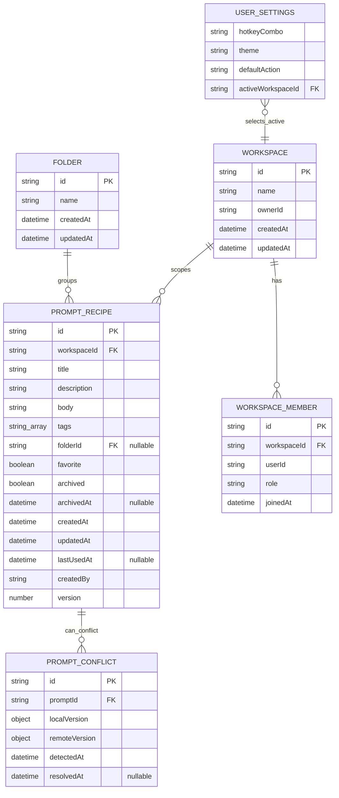

# Architecture

PromptDock is split into a React frontend, a small Rust/Tauri native layer, and swappable persistence backends. The default product experience is local-first: prompts are available without an account, network, or Firebase configuration.

## System Overview

```text
React UI
  AppShell, LibraryScreen, PromptEditor, SettingsScreen,
  CommandPalette, VariableFillModal, QuickLauncherWindow, ConflictCenter
        |
Zustand stores
  PromptStore, SettingsStore, AppModeStore, ToastStore
        |
Services
  AuthService, SyncService, ConflictService, ImportExportService,
  SearchEngine, VariableParser, PromptRenderer
        |
Repositories
  PromptRepository, SettingsRepository, WorkspaceRepository
        |
Storage and sync backends
  LocalStorageBackend       BrowserStorageBackend       FirestoreBackend
  Tauri Store JSON files    window.localStorage         Cloud Firestore
        |
Native Tauri commands
  clipboard, paste, hotkey, window, tray integration
```

## Runtime Modes

| Runtime | Detection | Storage | Native features |
|---|---|---|---|
| Tauri desktop | `__TAURI_INTERNALS__ in window` in `src/App.tsx` | `LocalStorageBackend`, backed by Tauri Store plugin JSON files | Global hotkey, tray, clipboard command, paste simulation, window hide/show |
| Browser | Tauri detection fails | `BrowserStorageBackend`, backed by `window.localStorage` | Browser clipboard fallback where available |
| Synced mode | User signs in or session restores | `PromptRepository` delegates prompt operations to `FirestoreBackend` | Firebase Auth, Firestore snapshots, offline cache |

The app has two Tauri windows configured in `src-tauri/tauri.conf.json`:

| Window | Label | Purpose |
|---|---|---|
| Main app | `main` | Full PromptDock UI. |
| Quick launcher | `quick-launcher` | Hidden, always-on-top prompt search overlay toggled by global hotkey. |

`src/main.tsx` reads the current Tauri window label. The quick-launcher window renders `QuickLauncherApp`; all other contexts render the main `App`.

## Main Modules

| Area | Files | Responsibilities |
|---|---|---|
| App bootstrap | `src/App.tsx`, `src/main.tsx` | Runtime detection, backend selection, repository/store initialization, default seeding, theme manager, hotkey registration, auth-session restore. |
| Layout and screens | `src/components/AppShell.tsx`, `src/screens/*` | Navigation, library, editor, settings, quick launcher, conflict center, modal orchestration. |
| State | `src/stores/*` | Prompt library state, settings, app mode/sync status, transient toasts. |
| Repositories | `src/repositories/*` | Data access contracts and concrete persistence implementations. |
| Services | `src/services/*` | Business logic: analytics tracking, auth, sync, conflict detection, import/export, parsing, rendering, search. |
| Firebase | `src/firebase/config.ts` | Lazy Firebase imports and cached Analytics/Auth/Firestore instances. |
| Utilities | `src/utils/*` | Clipboard, hotkeys, theme application, file dialog fallback, sidebar counts, folder localStorage bridge. |
| Native | `src-tauri/src/*` | Tauri command handlers, tray setup, global shortcut setup, paste simulation. |
| Types | `src/types/index.ts` | Shared domain models and result types. |

## Prompt Data Model

`PromptRecipe` in `src/types/index.ts` is the central domain record. A prompt is scoped to one workspace, can be organized by a folder and inline tags, and is soft-deleted when archived.



The `Folder` model does not currently store `workspaceId`; prompts reference folders through `folderId`, while synced folders are scoped by their Firestore path.

| Field group | Fields | Notes |
|---|---|---|
| Identity and tenancy | `id`, `workspaceId` | `workspaceId` is used by repositories and sync queries to isolate prompt lists. |
| Prompt content | `title`, `description`, `body` | `body` may contain `{{variable}}` placeholders parsed by `VariableParser` and rendered by `PromptRenderer`. |
| Organization | `tags`, `folderId`, `favorite` | Tags are inline strings on the prompt. Folders are referenced by ID. |
| Lifecycle | `archived`, `archivedAt`, `lastUsedAt` | Delete/archive flows are soft deletes. Use flows update `lastUsedAt`. |
| Audit and sync | `createdAt`, `updatedAt`, `createdBy`, `version` | Used for ordering, conflict detection, and local-to-Firestore migration. |

Important invariants:

- Components should treat the prompt returned by the repository/store action as the saved source of truth.
- Local create assigns a new `id`, `createdAt`, `updatedAt`, `createdBy: 'local'`, and `version: 1`.
- Local update preserves the existing `id`, refreshes `updatedAt`, and increments `version`.
- Archive and restore preserve the prompt record and toggle `archived` / `archivedAt`.
- Duplicate creates a new prompt ID, resets `version`, clears archive/use state, and prefixes the title with `Copy of`.
- `CreatePromptData` currently includes `createdBy` and `version` because it mirrors `IPromptRepository.create()`, but the local repository normalizes those fields on write.

## Prompt State Ownership

There are two intentional in-memory prompt collections:

| Owner | Collection | Purpose |
|---|---|---|
| `PromptRepository` | private `prompts` cache | Lazy-loaded persistence cache backed by `IStorageBackend`; filters by workspace when returning data. |
| `PromptStore` | Zustand `prompts` state | React-facing list for the active workspace; drives library, quick launcher, filters, and rerenders. |

The repository cache is not observable UI state. The store list is not durable storage. A store action calls the repository first, then merges the repository result into Zustand state.

`PromptStore` also owns UI state that does not belong in the repository:

| UI state | Why it belongs in the store |
|---|---|
| `isLoading` | Represents async load state for views. |
| `activeWorkspaceId` | Chooses which workspace list the UI is showing. |
| `selectedPromptId` | View/editor selection only. |
| `searchQuery`, `folderFilter`, `favoriteFilter` | Presentation filters over loaded prompts. |

`PromptRepository` owns persistence and record invariants:

| Repository concern | Behavior |
|---|---|
| Backend abstraction | Reads/writes through `IStorageBackend` in local/browser mode. |
| Firestore delegation | Forwards prompt operations to `FirestoreBackend` when synced mode installs a delegate. |
| Metadata normalization | Creates IDs, timestamps, local creator metadata, and versions in local mode. |
| Durable mutations | Persists every local create, update, archive, restore, duplicate, and favorite change. |
| Workspace filtering | `getAll(workspaceId)` and `reloadAll(workspaceId)` return prompts scoped to the requested workspace. |

## Data Flow

### Startup

1. `src/main.tsx` decides whether to render the main app or quick launcher.
2. `initializeApp()` in `src/App.tsx` selects `LocalStorageBackend` or `BrowserStorageBackend`.
3. Repositories are created around that backend.
4. Zustand singleton stores are initialized.
5. Default seed prompts are inserted into the `local` workspace if it is empty.
6. Prompts and settings are loaded into stores.
7. The global hotkey is registered best-effort in desktop mode.
8. Background services are created, optional Firebase Analytics tracking starts if configured, and auth-session restore may transition the app to synced mode.

### Local Prompt Create/Edit

1. `PromptEditor` gathers title, description, body, tags, folder, and favorite state.
2. `AppShell` calls `PromptStore.createPrompt()` or `PromptStore.updatePrompt()`.
3. `PromptStore` delegates to `PromptRepository`.
4. `PromptRepository` mutates an in-memory prompt cache and persists through `IStorageBackend`.
5. The store state updates and the UI rerenders.

```text
PromptEditor or library UI
  -> PromptStore action
  -> PromptRepository method
  -> LocalStorageBackend or BrowserStorageBackend
  -> PromptRepository returns saved PromptRecipe
  -> PromptStore merges result into Zustand state
  -> React UI rerenders
```

For archive/delete actions, `PromptRepository.softDelete()` marks the durable prompt as archived, while `PromptStore` removes it from the visible prompt list and clears `selectedPromptId` if needed. Restore calls `PromptRepository.restore()` and reloads the active workspace list.

### Search and Use

1. `TopBar`, `CommandPalette`, or `QuickLauncherWindow` accepts a query.
2. `SearchEngine` ranks matches across title, tags, description, and optionally body.
3. If the selected prompt has variables, `VariableFillModal` collects values and renders a preview.
4. Copy uses `copy_to_clipboard` in Tauri, falling back to browser clipboard APIs.
5. Paste copies first, hides the main window when appropriate, then invokes `paste_to_active_app`.

### Tag Derivation and Scalability

Tags are currently stored only as strings on each `PromptRecipe.tags` array. The sidebar tag list, sidebar tag counts, and library tag filter options are derived by scanning the loaded prompt collection in memory.

This keeps the local-first data model simple and works well for typical personal libraries, but the derivation cost is proportional to the number of loaded prompts times the average number of tags per prompt. Very large libraries or high-churn synced workspaces would repeatedly rescan the prompt list after create, update, archive, delete, or sync updates.

Before adding advanced tag management or optimizing for large synced workspaces, introduce a canonical tag index. A store-level derived index would be enough for medium-sized libraries; first-class persisted tag records should be used if tags need metadata such as display names, colors, aliases, pinned order, rename/delete flows, or server-side aggregation.

### Sync Transition

1. `AuthService` signs in or restores a Firebase Auth user.
2. `AppModeStore` moves toward `synced`.
3. `SyncService.transitionToSynced()` creates a `FirestoreBackend`.
4. Local prompts can be migrated into Firestore.
5. Firestore `onSnapshot` listeners update `PromptStore`.
6. `PromptRepository.setFirestoreDelegate()` forwards prompt CRUD to `FirestoreBackend`.
7. Conflicts are detected by comparing local and remote prompt versions and stored in `ConflictService`.

`AuthService` bootstraps the default user workspace and owner membership before synced mode starts Firestore prompt listeners.

After sync transition, the component and store APIs do not change. The write path changes inside the repository:

```text
Component
  -> PromptStore action
  -> PromptRepository method
  -> FirestoreBackend delegate
  -> Cloud Firestore write
  -> immediate store update from operation result
  -> later Firestore snapshot replaces PromptStore.prompts
```

Firestore snapshots are the authoritative visible list in synced mode. The store may update immediately from a write result, but the listener can replace the list with server-confirmed data, server timestamps, and remote changes from another client.

See [Sync](SYNC.md) for the detailed local-to-synced transition, migration behavior, offline handling, sign-out flow, and current caveats.

## API Boundaries

| Boundary | Contract | Notes |
|---|---|---|
| UI to state | Zustand store actions and selectors | Components should avoid talking directly to repositories. |
| State to data | Repository interfaces in `src/repositories/interfaces.ts` | Repositories hide local, browser, and Firestore persistence details. |
| Business logic | Service interfaces in `src/services/interfaces.ts` | Parsing, rendering, search, import/export, auth. |
| Web to native | Tauri `invoke()` commands | Clipboard, paste, hotkey, window commands are desktop-only and should have fallbacks or graceful failure. |
| App to Firebase | Lazy functions in `src/firebase/config.ts` | Firebase SDK imports happen only when sync or configured Analytics is used. |

## State Management

| Store | State | Important actions |
|---|---|---|
| `PromptStore` | prompts, loading state, active workspace, selection, filters, search query | load, create, update, duplicate, archive, restore, favorite, mark-used |
| `SettingsStore` | hotkey, theme, default action, active workspace | load, update |
| `AppModeStore` | `local`, `synced`, `offline-synced`, user ID, online state, sync status | set mode, user ID, online state, sync status |
| `ToastStore` | transient toast queue | add/remove toast |

Stores follow a factory plus singleton pattern:

- `createXxxStore(...)` creates a standalone store for tests.
- `initXxxStore(...)` initializes the production singleton.
- `useXxxStore(...)` reads from the initialized singleton.

## External Dependencies

| Dependency | Role |
|---|---|
| Tauri 2 | Desktop shell, windows, tray, command bridge. |
| Tauri plugins | Store, clipboard manager, global shortcut. |
| `enigo` | Cross-platform keyboard simulation for paste into active app. |
| Firebase | Optional Auth and Firestore sync. |
| React, Vite, TypeScript | Frontend runtime and build toolchain. |
| Zustand | Client state. |
| Tailwind CSS v4 | Utility CSS with local design tokens in `src/styles.css`. |
| Testing Library, Vitest, fast-check | Component, unit, integration, and property tests. |
| lucide-react | Icons. |

## Design Decisions

- Local-first default keeps the app useful without account setup or network access.
- Repository interfaces make storage backends swappable.
- Firestore is a delegate of `PromptRepository` instead of a separate UI pathway.
- Firebase imports are dynamic to avoid initializing sync dependencies in local mode.
- Tauri native calls are wrapped so browser development remains possible.
- The quick launcher is a separate Tauri window so it can stay hidden, focused, and always on top.
- Conflict tracking is currently in memory through `ConflictService`.
- Import/export is versioned JSON and excludes archived prompts.

## Known Architecture Gaps

- Synced mode currently assumes a single default personal workspace where `workspaceId` equals the Firebase user ID.
- Active workspace state is split across settings, prompt store, and sync assumptions.
- User-created folder persistence currently uses a localStorage utility outside the repository abstraction.
- Tags are derived from prompt arrays instead of a canonical tag index, which limits scalability and tag metadata workflows.
- No E2E test runner is configured for full Tauri window/hotkey/paste flows.

See [Deferred Issues](Issues.md), [Testing](TESTING.md), and [Troubleshooting](TROUBLESHOOTING.md).
