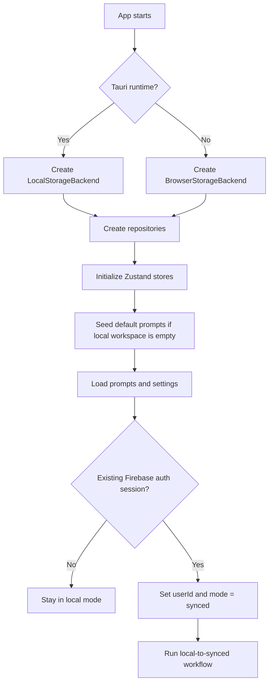
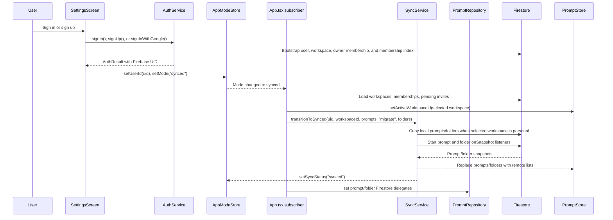
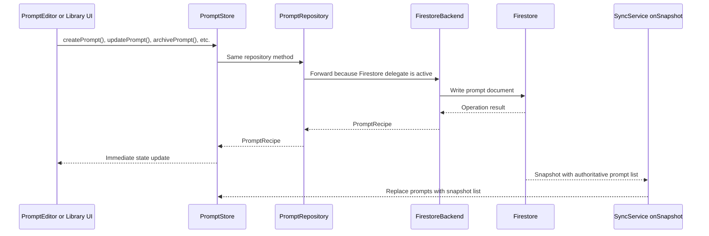
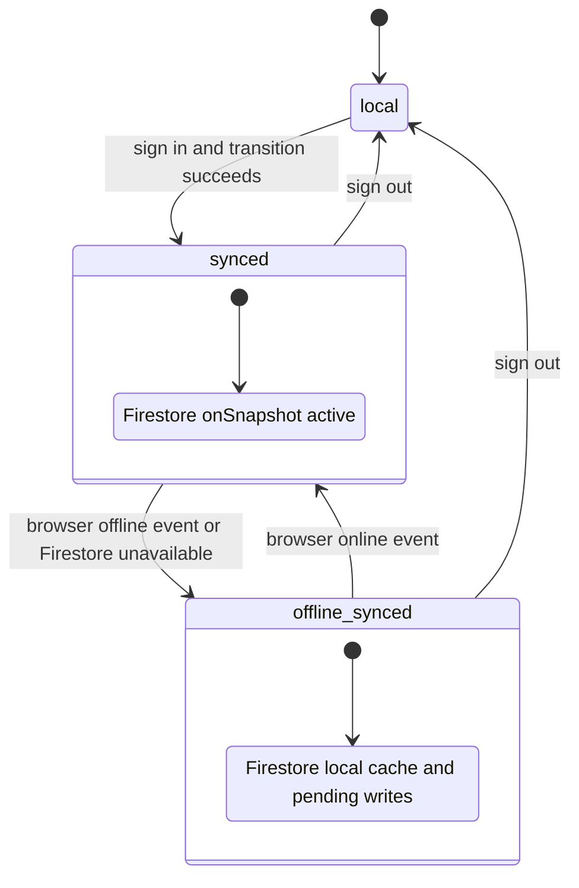
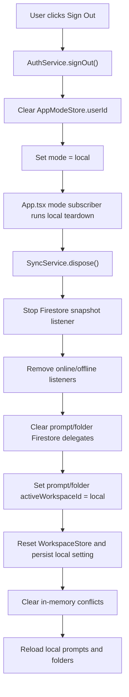

# Sync

PromptDock is local-first. The app starts in local mode, stores prompts on the device, and does not initialize Firebase unless the user signs in, restores an existing auth session, or Firebase Analytics is configured.

Synced mode adds Firebase Auth and Cloud Firestore on top of the same prompt store and repository APIs. The UI keeps using `PromptStore`; the repository layer changes where prompt operations are persisted.

## Modes

| Mode | Meaning | Prompt storage |
|---|---|---|
| `local` | Default mode. No account or network required. | `LocalStorageBackend` in Tauri or `BrowserStorageBackend` in browser. |
| `synced` | Firebase user is active and Firestore prompt listener is running. | `PromptRepository` delegates prompt operations to `FirestoreBackend`. |
| `offline-synced` | A signed-in user is offline or the Firestore listener reports an unavailable state. | Firestore SDK local cache handles pending writes where possible. |

`AppModeStore` owns the current mode, signed-in user ID, online state, sync status, and `lastSyncedAt`.

## Main Pieces

| Piece | File | Role |
|---|---|---|
| App bootstrap | `src/App.tsx` | Chooses the local storage backend, initializes repositories/stores, restores auth, and reacts to mode changes. |
| Auth service | `src/services/auth-service.ts` | Signs users in or out, restores sessions, and bootstraps the user's Firestore workspace documents. |
| App sync lifecycle | `src/services/app-sync-lifecycle.ts` | Reacts to auth/app-mode and workspace changes, wires repository delegates, and handles sign-out teardown. |
| Sync service | `src/services/sync-service.ts` | Migrates local prompts, starts/stops Firestore snapshots, tracks online/offline state, and updates sync status. |
| Prompt repository | `src/repositories/prompt-repository.ts` | Uses local storage by default, then forwards prompt CRUD to Firestore when a delegate is installed. |
| Firestore backend | `src/repositories/firestore-backend.ts` | Implements prompt CRUD against `workspaces/{workspaceId}/prompts`. |
| Workspace repository | `src/repositories/workspace-repository.ts` | Manages synced workspace metadata, membership indexes, email invites, and domain viewer invites. |
| Workspace store | `src/stores/workspace-store.ts` | Owns active workspace selection, roles, members, outgoing invites, and pending invites for the signed-in user. |
| Conflict service | `src/services/conflict-service.ts` | Tracks in-memory local/remote prompt conflicts detected by sync. |

## Startup

1. `initializeApp()` detects the runtime:
   - Tauri desktop uses `LocalStorageBackend`, backed by Tauri Store JSON files.
   - Browser runtime uses `BrowserStorageBackend`, backed by `window.localStorage`.
2. `PromptRepository` and `SettingsRepository` are created around that local backend.
3. `PromptStore`, `FolderStore`, `SettingsStore`, `WorkspaceStore`, and `AppModeStore` are initialized.
4. Seed prompts are inserted into the `local` workspace if needed.
5. Prompts, folders, and settings load from local storage.
6. `AuthService.restoreSession()` may find an existing Firebase user. If it does, `AppModeStore.userId` is set and mode becomes `synced`.

Firebase SDK imports are dynamic. Local-only startup does not call `getFirebaseAuth()` or `getFirebaseFirestore()`.

## Workflow Overview

### Local Startup



### Local To Synced



## Switching From Local To Synced

The normal Settings flow is sign-in or sign-up. Authentication success is what moves `AppModeStore` into `synced`; workspace controls then load from `WorkspaceStore`.

1. The user signs in with email/password or Google from `SettingsScreen`.
2. `AuthService` authenticates with Firebase Auth.
3. On auth success, `AuthService` bootstraps these Firestore documents:
   - `/users/{uid}`
   - `/workspaces/{uid}`
   - `/workspaces/{uid}/members/{uid}`
   - `/workspaceMemberships/{uid_uid}`
4. The UI stores the Firebase user in `AppModeStore` and sets `AppModeStore.mode` to `synced`.
5. `AppSyncLifecycle` reacts to that mode change and calls `WorkspaceStore.loadForUser(user, preferredWorkspaceId)`.
6. `WorkspaceStore` bootstraps the personal workspace, loads the user's membership index, loads pending email/domain invites, and chooses the preferred active workspace when it is still available; otherwise it falls back to the personal workspace.
7. `PromptStore.activeWorkspaceId`, `FolderStore.activeWorkspaceId`, and `settings.activeWorkspaceId` are updated to the chosen workspace ID.
8. `SyncService` is created with callbacks:
   - remote prompt snapshots replace `PromptStore.prompts`
   - remote folder snapshots replace `FolderStore.folders`
   - detected conflicts are passed to `ConflictService`
9. `SyncService.transitionToSynced(userId, workspaceId, currentPrompts, migrationChoice, currentFolders)` runs.
10. After the transition completes, prompt and folder repository delegates make future prompt/folder operations go to Firestore.

## Local Prompt Migration

By default, `initializeApp()` passes `syncMigrationChoice = 'migrate'`. During the first transition into the personal workspace, `SyncService` receives the current prompt and folder lists and copies them into Firestore.

For each local prompt:

1. It checks `workspaces/{uid}/prompts/{prompt.id}`.
2. If a document with that prompt ID already exists, migration skips it.
3. Otherwise it writes the prompt with:
   - the same prompt ID
   - `workspaceId` changed to the Firebase UID workspace
   - `createdBy` changed to the Firebase UID
   - `Date` values converted to Firestore timestamps
   - the existing prompt `version`

Folder migration also copies local folders into `workspaces/{uid}/folders`, skipping duplicate normalized folder names.

Migration copies data; it does not delete local prompts or folders from local storage. After sign-out, the app returns to the `local` workspace and reloads the local prompt and folder lists.

When the user switches to or creates a non-personal synced workspace, `AppSyncLifecycle` transitions with `migrationChoice = 'fresh'`, clears the visible local prompt/folder lists, and lets Firestore snapshots populate that workspace.

## Firestore Listener

`SyncService` starts `onSnapshot` listeners on:

```text
workspaces/{workspaceId}/prompts
workspaces/{workspaceId}/folders
```

The prompt query filters documents whose `workspaceId` field matches the current workspace ID. Each prompt snapshot is converted back to `PromptRecipe` objects, then:

1. conflicts are detected against the previous local snapshot,
2. `localPromptsSnapshot` is replaced with the remote list,
3. `PromptStore.prompts` is replaced with the remote list,
4. sync status becomes `synced` when the app is in synced mode.

This means Firestore snapshots are the source of truth for the visible prompt list in synced mode.

Folder snapshots are converted to `Folder` objects and replace `FolderStore.folders`. Folder snapshots are independent from prompt snapshots so folder-only edits still update the UI.

## Prompt CRUD In Synced Mode

Components keep calling `PromptStore` actions such as `createPrompt`, `updatePrompt`, `archivePrompt`, and `toggleFavorite`.

`PromptStore` still delegates to `PromptRepository`, but after sync transition `PromptRepository` has a Firestore delegate. Its prompt methods forward to `FirestoreBackend`:

- `create()` uses `addDoc()` under `workspaces/{workspaceId}/prompts`.
- `getAll()` queries prompt documents by workspace ID.
- `update()` writes changed fields, sets `updatedAt` to `serverTimestamp()`, and increments `version`.
- `softDelete()` marks a prompt archived.
- `restore()`, `duplicate()`, and `toggleFavorite()` use the same Firestore path.
- `duplicateToWorkspace()` can write a copy into another workspace where the user has owner/editor access.

The store updates optimistically from the operation result, and the snapshot listener can later replace the store with the authoritative Firestore list.

`FolderStore` follows the same delegate pattern through `FolderRepository` and `FirestoreBackend` for create/delete/reload operations. UI actions check the current workspace role first: owners and editors can mutate prompts/folders, while viewers can search, copy, and paste but cannot edit/import/archive/delete.

### Synced Prompt Write



## Offline And Reconnection

Firestore initializes with `persistentLocalCache()`, so the Firebase SDK can cache remote data and pending writes.

`SyncService` also listens to browser `online` and `offline` events:

- On offline, mode becomes `offline-synced`, `isOnline` becomes `false`, and sync status becomes `offline`.
- On online, if the app was `offline-synced`, mode returns to `synced`, sync status becomes `syncing`, and then becomes `synced` after a short delay.

The code relies on the Firestore SDK to flush pending writes and emit updated snapshots after reconnection.

### Offline And Online



## Sign-Out

When the user signs out:

1. `AuthService.signOut()` signs out of Firebase Auth.
2. `AppModeStore.userId` is cleared and mode becomes `local`.
3. `App.tsx` tears down `SyncService`.
4. Firestore snapshot and online/offline listeners are removed.
5. Prompt and folder repository Firestore delegates are cleared so local storage persistence is restored.
6. `PromptStore.activeWorkspaceId` and `FolderStore.activeWorkspaceId` return to `local`.
7. `WorkspaceStore` resets to the local workspace, and `settings.activeWorkspaceId` persists `local`.
8. In-memory conflicts are cleared.
9. Local prompts and folders reload from local storage.

### Sign-Out Workflow



## What Sync Covers Today

Currently synced:

- prompt recipes in `workspaces/{workspaceId}/prompts`
- user-created folders in `workspaces/{workspaceId}/folders`
- synced workspace metadata in `/workspaces/{workspaceId}`
- workspace members in `/workspaces/{workspaceId}/members/{userId}`
- denormalized workspace membership rows in `/workspaceMemberships/{workspaceId_userId}`
- pending email invites in `/workspaceInvites/{inviteId}`
- active viewer domain invites in `/workspaceDomainInvites/{workspaceId_domain}`
- auth session state through Firebase Auth
- the default personal workspace and owner membership bootstrap

Not fully synced today:

- settings, despite the Firestore rules including a `/settings/{userId}` path
- conflict records, which are tracked in memory by `ConflictService`
- local-only multi-workspace management; local mode still exposes one `local` workspace

## Important Caveats

- Migration skips existing remote prompt IDs instead of merging or overwriting them.
- Remote snapshots replace the whole visible prompt list in synced mode.
- Local data remains available after sign-out because migration copies local prompts rather than moving them.
- Domain invites are exact-domain viewer invites only; they do not grant editor access and do not match subdomains.
- Email invites are stored in Firestore for in-app acceptance after the recipient signs in with the same email. The client does not send outbound email.
